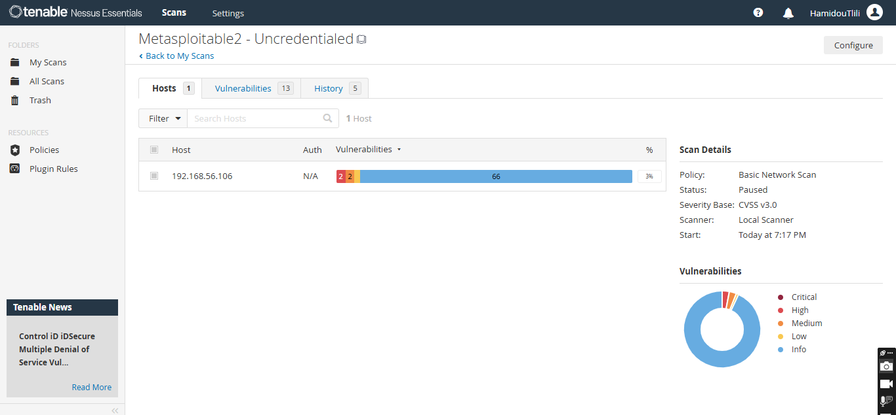
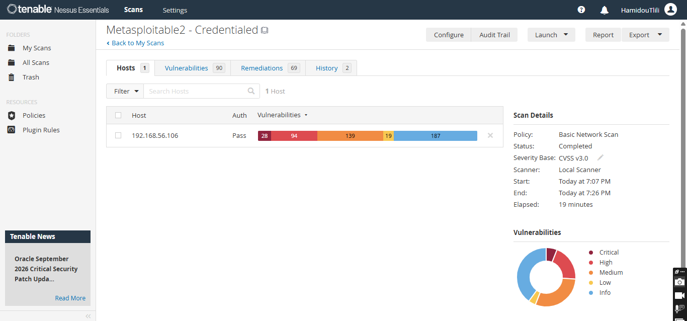
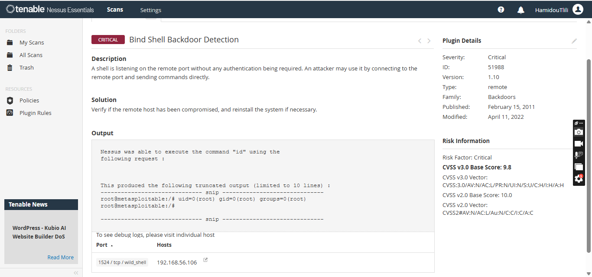
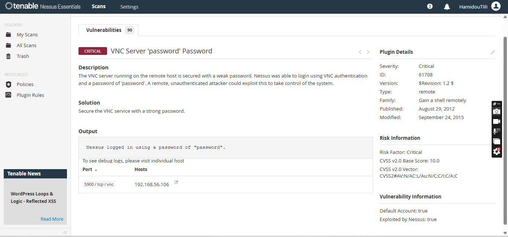
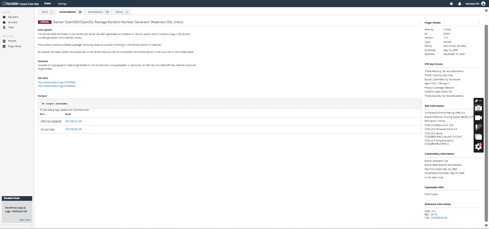
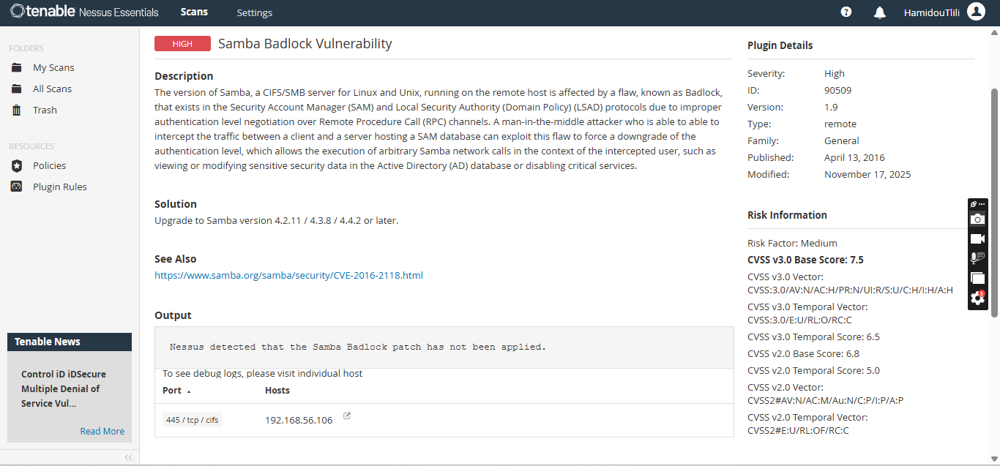
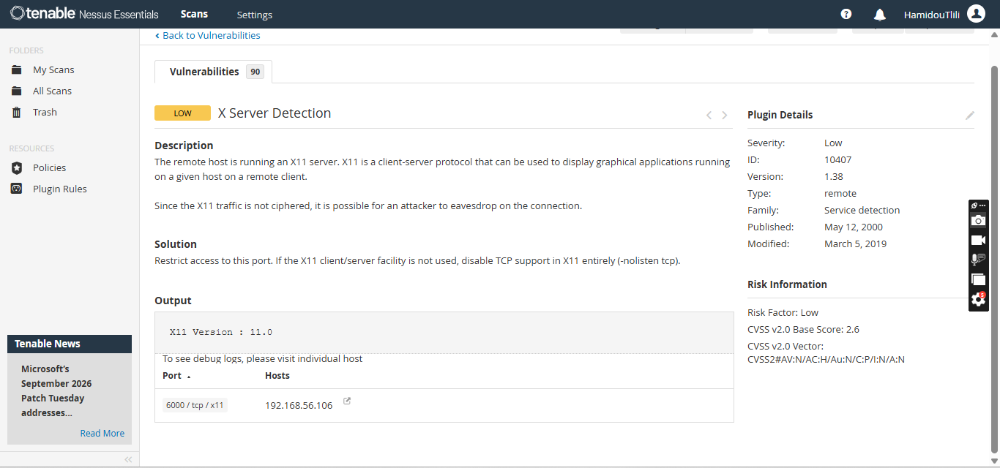

# Vulnerability Scan & Remediation Report — Nessus Essentials

## Summary
Ran an uncredentialed and a credentialed vulnerability scan with **Nessus Essentials** against a
deliberately vulnerable lab target (Metasploitable2, isolated on a host-only VirtualBox network),
then analyzed the findings, separated **severity from real risk**, and wrote a prioritized
remediation report — instead of just forwarding the raw scanner output.

## Tools used
- Nessus Essentials (free tier)
- VirtualBox + Metasploitable2 (intentionally vulnerable practice VM, isolated host-only network)

## Scope
1 lab host (`192.168.56.106`), scanned twice: once without credentials (external view) and once
with SSH credentials (internal/authenticated view), on a network isolated to the local machine
only.

## Method

### 1. Set up and scan
Ran a Basic Network Scan twice against the same target — once uncredentialed, once with SSH
credentials (`msfadmin`). The difference between the two was dramatic:

| Scan | Findings | Critical | High |
|---|---|---|---|
| Uncredentialed | 13 | 0 | 1 |
| Credentialed | 90 | 28 | 94 |

An unauthenticated scan can only see what's exposed externally; a credentialed scan inspects
installed packages, configs, and local vulnerabilities directly — which is exactly why real SOC
and vuln management programs run both.




### 2. Severity is not risk
Four findings across the severity spectrum, picked to show that a CVSS score alone doesn't tell
you what to fix first:

**Bind Shell Backdoor Detection + VNC 'password' Password — Critical (CVSS 9.8–10.0)**
Neither of these has a CVE — they aren't software bugs to patch, they're an **open root shell
with no authentication** (port 1524) and a VNC service secured with the literal password
`"password"`. There's no exploitation step required; the access is already there. Highest
possible priority regardless of any score.




**Debian OpenSSH/OpenSSL Weak RNG — Critical (CVSS 10.0, CVE-2008-0166)**
A Debian packaging bug that stripped most entropy from OpenSSL's random number generator,
making SSH/SSL private keys guessable. Nessus flags a public exploit as available and this
vulnerability has well-documented, real-world exploitation history — another clear "fix now."



**Samba Badlock Vulnerability — High (CVSS 7.5, CVE-2016-2118)**
A protocol downgrade flaw in Samba's SAM/LSAD services. High CVSS, but it requires a
man-in-the-middle position on the network to exploit, and it does **not** appear on the CISA
Known Exploited Vulnerabilities (KEV) catalog. A patch exists (Samba 4.2.11 / 4.3.8 / 4.4.2+).



**X Server Detection — Low (CVSS 2.6)**
Unencrypted X11 traffic detectable on port 6000. Real risk here depends entirely on network
reachability, which in this isolated lab is limited to the local machine — a case for formally
accepting the risk rather than acting on it.



> CVSS tells you how bad the flaw could be. Exposure tells you how likely it gets used. The KEV
> list tells you it's already being used. The scanner sorts by score — analysts sort by risk.

### 3. Prioritized fix list
| Priority | Criteria | Findings |
|---|---|---|
| First | Already-open access / public exploit, no MITM needed | Bind Shell Backdoor, VNC weak password, Debian OpenSSL Weak RNG |
| Second | High score, patch available, not on KEV | Samba Badlock |
| Last | Low score, requires direct local network access | X Server Detection |

## Report

```
SCOPE: 1 lab host (Metasploitable2, isolated VirtualBox host-only network), credentialed scan
FOUND: 90 distinct findings — severity breakdown: 28 Critical, 94 High, 139 Medium, 19 Low, 187 Info
FIX NOW: 3 items — root-level backdoor (port 1524), VNC weak password, Debian OpenSSL weak RNG (public exploit available)
FIX THIS MONTH: Samba Badlock — patch available (upgrade to Samba 4.2.11 / 4.3.8 / 4.4.2+)
ACCEPTED: X Server Detection (Low) — isolated lab network, no external reachability, accepted as low priority
RETEST: Rescan planned after remediation applied in this lab environment
```

Lead with the three that matter, not the total finding count.
Every accepted risk needs a name/reason next to it.
A finding without an owner never gets fixed.

## What I learned
Running the same target twice made the value of credentialed scanning concrete: findings went
from 13 to 90, and every single Critical was only visible once Nessus had SSH access. It also
reframed how I'd read a scanner report — a 7.5 CVSS finding (Badlock) turned out to be lower
real-world priority than several findings with no CVE at all, because those were already-open
backdoors rather than theoretical flaws. Checking the CISA KEV catalog directly, rather than
going by CVSS score alone, changed which finding I'd actually escalate first.

---

### LinkedIn post draft

> Ran a full vulnerability assessment with Nessus Essentials on a lab environment: credentialed
> and uncredentialed scans (13 → 90 findings once authenticated), then the part that actually
> matters — separating CVSS severity from real-world risk (exposure + known exploitation) to
> build a prioritized, ownable fix list instead of just forwarding a scanner PDF.
>
> Full write-up on GitHub: [link]
>
> #cybersecurity #vulnerabilitymanagement #Nessus #blueteam
